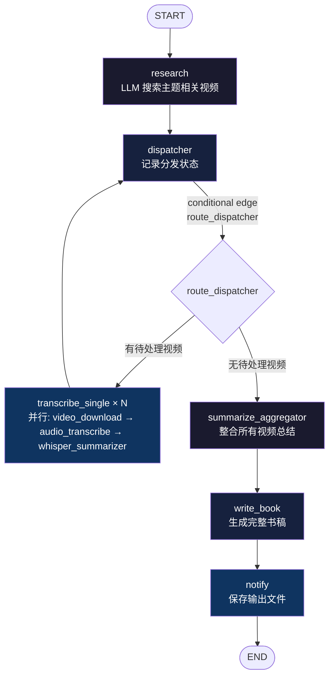

# 01-video-md Pipeline

视频主题研究 → 批量下载 → 转录 → AI 总结 → 书稿生成

## 功能

输入一个主题关键词，Pipeline 自动：
1. 调用 LLM 搜索相关视频（research）
2. 并行下载 + 转录所有视频（fan-out，LangGraph Send API）
3. AI 总结每个视频内容
4. 整合所有视频总结
5. 生成完整结构化书稿
6. 输出文件到 `output/`

## 流程图



## 工具链

| 步骤 | 工具 | 说明 |
|------|------|------|
| 下载 | `video_download` | B站直取字幕 / YouTube字幕 / yt_dlp 音频下载 |
| 转录 | `audio_transcribe` | faster-whisper 本地转录音频→SRT |
| 总结 | `whisper_summarizer` | MiniMax API SRT→结构化摘要 |

## 触发方式

```bash
cd ~/Workbase/ai-pipeline/01-video-md/

# 启动新 pipeline
./run.py start "AI Agent 发展趋势"
./run.py start --topic "AI Agent 发展趋势" --thread-id my-thread

# 查看状态
./run.py status --thread-id my-thread

# 继续被中断的 pipeline
./run.py continue --thread-id my-thread

# 列出所有 thread
./run.py list

# 打印架构图
./run.py graph
```

## 参数说明

| 参数 | 说明 |
|------|------|
| `topic` | 主题关键词（必填），Pipeline 据此搜索相关视频并生成书稿 |
| `--thread-id` | 线程 ID（默认 `default`），用于持久化 checkpoint 和断点恢复 |

## 输出结构

```
01-video-md/output/
├── research/               # LLM 研究结果
│   └── {topic}/
│       └── research_results.json
├── transcribe/             # 每个视频的下载+转录+总结结果
│   └── task-{idx}/
│       ├── (音视频文件)
│       ├── subtitle.txt / .srt
│       └── summary.json
├── summarize/              # 聚合总结（预留）
└── book/                   # 最终书稿
    └── {topic}_书稿.md
```

## 关键设计约束

- **List[Send] 只能从 conditional edge 函数返回**，不能从任何 node 函数返回
- `dispatcher` 是纯分发 node，返回空 dict `{}`
- 真正的 fan-out 路由在 `route_dispatcher` conditional edge 中
- 并行节点的结果通过 `Annotated[list, lambda a,b: a+b]` reducer 自动合并到父 state
- Checkpoint 持久化：SqliteSaver，写入 `./checkpoints.db`
- 每个视频的任务输出到独立的 `task-{idx}/` 子目录，避免并行写入冲突

## 依赖

- Python: `/Users/zyongzhu/Workbase/Msg-collect/.venv/bin/python`
- 工具路径: `/Users/zyongzhu/Workbase/tools/src/`（video_download, audio_transcribe, whisper_summarizer）
- 依赖包: `langgraph`, `langgraph-checkpoint-sqlite`, `python-dotenv`, `requests`, `faster-whisper`, `yt-dlp`
- 环境变量: `MINIMAX_CN_API_KEY`（见 `.env`）
