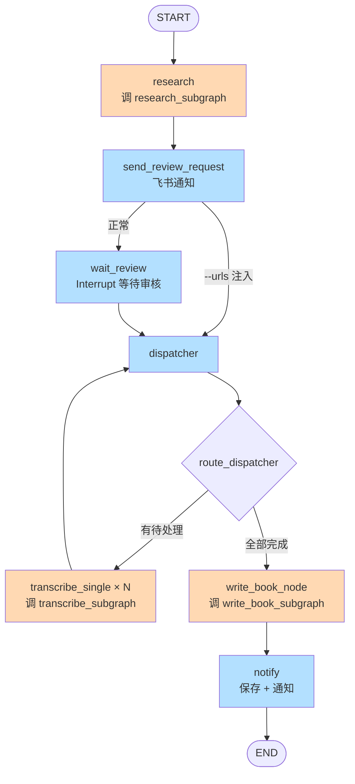

# 01-video-md Pipeline

视频主题研究 → 人工审核 → 批量转录 → AI 书稿生成

## 架构定位

**v2 架构**：主 Graph 只做编排，业务能力抽成可复用 SubGraph。

```
01-video-md/
├── main_graph.py              # 主 Graph（只编排）
├── run.py                     # CLI 入口
└── tools_src/                 # 工具源码（download/transcribe/summarize）

ai-pipeline/subgraphs/          # 可复用组件库（共享给所有 Pipeline）
├── research_subgraph/          # 主题 → 候选视频
├── transcribe_subgraph/        # 视频 → 摘要（3 步）
├── write_book_subgraph/        # 摘要聚合 → 书稿（2 步）
└── shared/                     # llm / timeout 等共享工具
```

规范：`vault/space/crafted/study/langgraph-subgraph/subgraph-design-spec.md`

## 功能

输入主题关键词，Pipeline 自动：

1. **research_subgraph** — LLM 搜索相关视频
2. **主 Graph 特有** — 发飞书审核 → Interrupt 等待
3. **主 Graph 特有** — 审核通过后 fan-out 分发
4. **transcribe_subgraph** × N — 每个视频并行走：下载 → 转录 → 总结
5. **write_book_subgraph** — 摘要聚合 → 生成书稿
6. **主 Graph 特有** — 保存文件 + 飞书通知

## 主 Graph 流程



**橙色节点** = 调用 SubGraph  
**蓝色节点** = 主 Graph 特有逻辑（HITL / 分发 / 通知）

## 主 Graph 职责（只做这些）

- ✅ 编排三个 SubGraph 的调用顺序
- ✅ Pipeline 特有的 HITL 审核逻辑
- ✅ fan-out 分发（只有主 Graph 知道有几个视频）
- ✅ Pipeline 特有的飞书通知
- ❌ 不做业务逻辑（研究/转录/书稿全在 SubGraph）

## 触发方式

```bash
cd ~/Workbase/ai-pipeline/01-video-md/

# 启动新 pipeline
./run.py start "AI Agent 发展趋势"
./run.py start --topic "AI Agent 发展趋势" --thread-id my-thread

# --urls 注入模式（跳过研究和审核）
./run.py start --topic "X" --urls "https://...,https://..."

# 查看状态
./run.py status --thread-id my-thread

# 继续被中断的 pipeline
./run.py continue --thread-id my-thread

# 审核命令
./run.py approve --thread-id my-thread
./run.py reject --thread-id my-thread
./run.py modify --thread-id my-thread --approved "url1,url2"

# 列出所有 thread
./run.py list

# 打印架构图
./run.py graph
```

## 输出结构

```
01-video-md/output/
├── research/               # research_subgraph 的产出
│   └── {topic}/
│       └── research_results.json
├── transcribe/             # transcribe_subgraph 的产出（按 task_idx 隔离）
│   └── task-{idx}/
│       ├── (音视频文件)
│       ├── subtitle.txt / .srt
│       └── summary.json
└── book/                   # 主 Graph 的最终输出
    └── {topic}_书稿.md
```

## SubGraph 独立测试

三个 SubGraph 都可以脱离主 Graph 单独跑：

```bash
cd ai-pipeline/

# 测试研究
python -m subgraphs.research_subgraph.test "AI Agent 发展趋势"

# 测试转录（单视频完整跑）
python -m subgraphs.transcribe_subgraph.test "https://www.bilibili.com/video/BV.../"

# 测试书稿生成（mock 数据）
python -m subgraphs.write_book_subgraph.test
```

## 关键设计约束

- **List[Send] 只能从 conditional edge 函数返回**，不能从任何 node 函数返回
- `dispatcher` 是纯分发 node，返回空 dict `{}`
- 真正的 fan-out 路由在 `route_dispatcher` conditional edge 中
- 并行节点的结果通过 `Annotated[list, lambda a,b: a+b]` reducer 自动合并到父 state
- Checkpoint 持久化：SqliteSaver，写入 `./checkpoints.db`
- 每个视频的任务输出到独立的 `task-{idx}/` 子目录，避免并行写入冲突
- **父子 State 通过 node 函数手动映射**（模式 2 独立 Schema）

## SubGraph 复用示例

未来新建一个"播客 → 书稿" Pipeline，只需要：

```python
# 02-podcast-md/main_graph.py
from subgraphs.transcribe_subgraph import build_transcribe_subgraph
from subgraphs.write_book_subgraph import build_write_book_subgraph

# 直接复用，不用改 SubGraph 任何代码
transcribe = build_transcribe_subgraph(config)
write_book = build_write_book_subgraph(config)
```

## 依赖

- Python: `/Users/zyongzhu/Workbase/ai-pipeline/.venv/bin/python`
- 工具路径: `./tools_src/`
- 依赖包: `langgraph`, `langgraph-checkpoint-sqlite`, `python-dotenv`, `requests`, `faster-whisper`, `yt-dlp`
- 环境变量:
  - `MINIMAX_CN_API_KEY`（LLM 调用）
  - `FEISHU_APP_ID` / `FEISHU_APP_SECRET`（审核通知）

## 迁移历史

- **v1**（已归档为 `pipeline.py.old`）：单文件 758 行，所有 node 写在一起
- **v2**（当前）：主 Graph + 3 SubGraph，业务逻辑可复用
