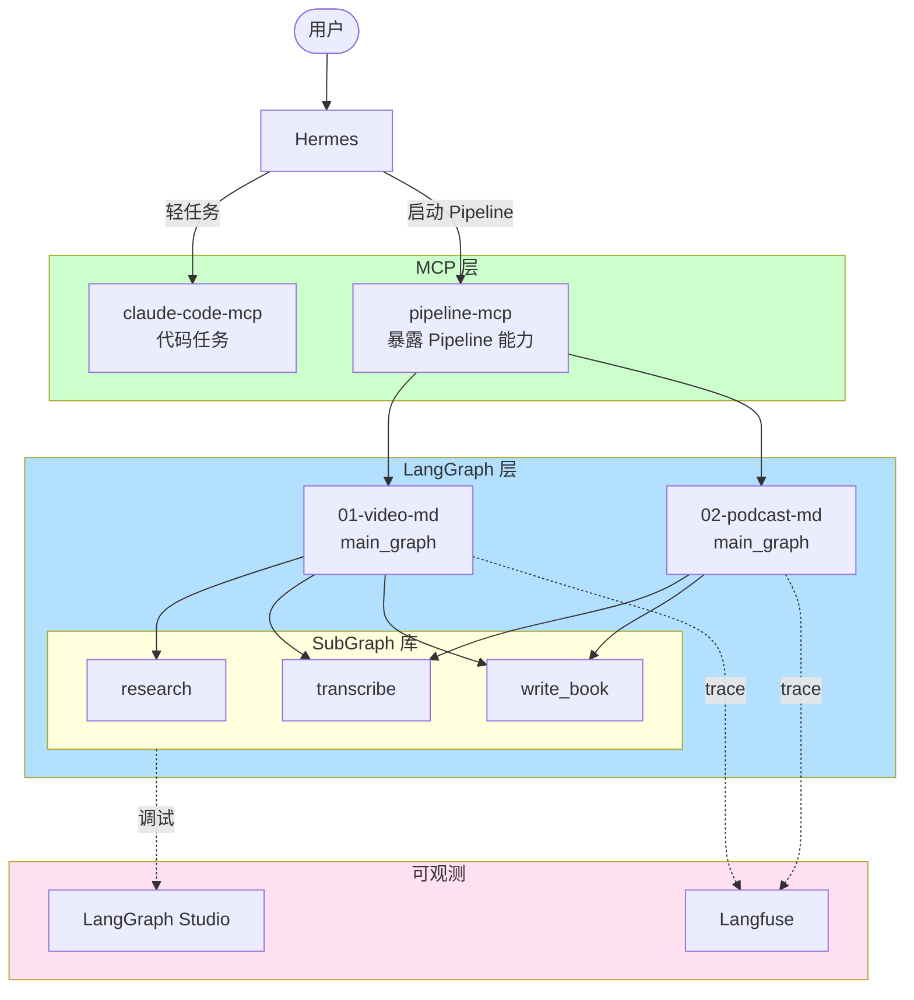

# HERMES TASK — ai-pipeline 工程化落地

> **给 Hermes 的工程化施工说明书**
> **阅读对象**：Hermes（你读完后 delegate 给 Claude Code 执行）
> **目标**：把 `ai-pipeline/` 从"能跑"升级到"工程化可交付"
> **版本**：v1.0（2026-04-24）

---

## 〇、读完本文档后你要做什么

1. 从头到尾读一遍，建立全局认知
2. 按「五、任务清单」逐阶段委派给 Claude Code
3. 每完成一个阶段，在「九、执行日志」追加记录
4. 遇到决策点（文档里标 ⚠️ 的）先问我，不要自己拍板
5. 全部完成后，跑「七、最终验收」的所有命令，结果截图给我

**不用等我催，按顺序推进。每阶段完成主动告诉我。**

---

## 一、背景与现状

### 1.1 项目定位

`ai-pipeline/` 是我的**内容创作流水线库**，用 LangGraph 搭建。核心设计理念：

- **SubGraph 作为可复用组件**（不用 MCP 暴露节点，避免大模型上下文膨胀）
- **主 Graph 只做编排**（业务逻辑下沉到 SubGraph）
- **LangGraph 单栈**（不引入 Temporal，用 Checkpointer 做持久化）

### 1.2 当前状态（已完成）

```
ai-pipeline/
├── subgraphs/                          # ✅ 已完成
│   ├── shared/                         # 共享工具（llm / timeout）
│   ├── research_subgraph/              # 主题 → 候选视频
│   ├── transcribe_subgraph/            # 视频 → 摘要（3 步）
│   └── write_book_subgraph/            # 摘要 → 书稿
│
└── 01-video-md/
    ├── main_graph.py                   # ✅ 已完成，只做编排
    ├── run.py                          # ✅ 已接入 main_graph
    ├── pipeline.py.old                 # 📦 旧单体版本已归档
    └── readme.md                       # ✅ 已更新为 v2
```

### 1.3 技术栈锁定

| 层 | 技术 | 说明 |
|----|------|------|
| 编排 | **LangGraph** | SubGraph 组合 + Checkpointer 持久化 |
| 可视化/调试 | **LangGraph Studio** | 开发期必开 |
| LLM 可观测 | **Langfuse** | trace / 成本 / eval，自部署 |
| 执行代理 | **Claude Code MCP** | Hermes 通过 MCP 指挥 Claude Code 干活 |
| 长流程可靠性 | **Checkpointer（SqliteSaver）** | 崩了手动重启接受 |
| ❌ 明确不用 | Temporal、MCP 暴露节点 | 已弃用 |

### 1.4 设计规范（必读）

在动手前，Claude Code **必须先读这份规范**：

```
vault/space/crafted/study/langgraph-subgraph/subgraph-design-spec.md
```

所有 SubGraph 设计、新增、修改都要遵守这份规范。违反规范的产出**直接打回重做**。

---

## 二、目标状态（全家桶完成后）

```
ai-pipeline/
├── HERMES_TASK.md                      # 本文件
├── README.md                           # 🆕 项目总览
├── requirements.txt                    # 🆕 依赖锁定
├── pyproject.toml                      # 🆕 项目元数据
├── .env.example                        # 🆕 环境变量模板
├── Makefile                            # 🆕 常用命令集合
│
├── subgraphs/                          # 已完成的三个 SubGraph
│   ├── shared/
│   ├── research_subgraph/
│   │   └── 🆕 完整测试 + Studio 配置
│   ├── transcribe_subgraph/
│   │   └── 🆕 完整测试 + Studio 配置
│   └── write_book_subgraph/
│       └── 🆕 完整测试 + Studio 配置
│
├── observability/                      # 🆕 可观测
│   ├── langfuse_setup.md               # Langfuse 自部署指南
│   ├── langfuse_integration.py         # LangGraph ↔ Langfuse
│   └── studio_config.md                # LangGraph Studio 使用指南
│
├── mcp_server/                         # 🆕 Pipeline MCP Server
│   ├── server.py                       # 暴露 pipelines 给 Hermes
│   ├── tools.py                        # MCP 工具定义
│   └── README.md
│
├── 01-video-md/                        # 已完成 Pipeline
│   └── 🆕 接入 Langfuse + Studio 配置
│
└── 02-podcast-md/                      # 🆕 第二个 Pipeline（复用验证）
    ├── main_graph.py                   # 复用 transcribe + write_book
    ├── run.py
    └── readme.md
```

---

## 三、核心架构图



---

## 四、Hermes 的执行规则

### 4.1 每个任务的标准流程

```
1. 读任务描述 → 理解目标
2. 读相关规范文件 → 建立约束
3. 写 prompt 给 Claude Code
4. shell 执行：claude -p "<prompt>" --cwd <workdir> --allowedTools ...
5. 收到结果 → 跑验收命令
6. 验收通过 → 追加执行日志 → 进入下一任务
7. 验收失败 → 把失败信息再给 Claude Code 让它修 → 最多重试 3 次
8. 3 次仍失败 → 停下来找我
```

### 4.2 给 Claude Code 的 prompt 模板

```
任务：<任务标题>

背景：
- 项目路径：/Users/zyongzhu/workbase/github/moon/ai-pipeline
- 必读规范：vault/space/crafted/study/langgraph-subgraph/subgraph-design-spec.md

要求：
<具体要求，列出产出物、约束、风格>

验收标准：
- [ ] <可验证的标准 1>
- [ ] <可验证的标准 2>

允许的工具：Read, Write, Edit, Bash, Glob, Grep
最大轮数：20
```

### 4.3 Claude Code 的调用方式

```bash
claude -p "<prompt>" \
  --cwd /Users/zyongzhu/workbase/github/moon/ai-pipeline \
  --allowedTools "Read,Write,Edit,Bash,Glob,Grep" \
  --max-turns 20
```

### 4.4 进度汇报

每完成一个任务，用自然语言告诉我：

```
✅ 阶段 X 任务 Y 完成
- 产出：<文件列表>
- 验收：<验收结果>
- 问题：<遇到的问题，如无写"无"> 
- 下一步：<下个任务编号>
```

---

## 五、任务清单（按阶段推进）

### 阶段 1：项目工程化底座（预计 2 小时）

**目标**：让项目有标准的 Python 工程结构。

#### 任务 1.1：创建 `requirements.txt`

给 Claude Code 的任务：

> 扫描 `ai-pipeline/` 下所有 `.py` 文件的 import 语句，生成 `requirements.txt`。
> - 只包含第三方库（不含标准库）
> - 版本号用 `>=` 不锁死（后续再锁）
> - 按字母排序
> - 包含：langgraph、langchain-core、httpx、openai、python-dotenv 等

**产出**：`ai-pipeline/requirements.txt`

**验收**：
```bash
pip install -r requirements.txt  # 能装上
```

#### 任务 1.2：创建 `pyproject.toml`

> 按 PEP 621 标准创建 `pyproject.toml`：
> - name: ai-pipeline
> - version: 0.1.0
> - python: >=3.10
> - 声明 subgraphs 为包（src layout 不要，直接 flat）

**产出**：`ai-pipeline/pyproject.toml`

**验收**：
```bash
cd ai-pipeline && pip install -e .  # 能 editable 安装
```

#### 任务 1.3：创建 `.env.example`

> 列出所有需要的环境变量，每个带注释说明用途：
> - MINIMAX_API_KEY（已有，LLM 调用）
> - LANGFUSE_PUBLIC_KEY（后续接入）
> - LANGFUSE_SECRET_KEY
> - LANGFUSE_HOST
> - ANTHROPIC_API_KEY（Claude Code 用）

**产出**：`ai-pipeline/.env.example`

#### 任务 1.4：创建 `Makefile`

> 提供常用命令快捷方式：
> - `make install` → pip install -e .
> - `make test` → 跑所有 SubGraph 的 test.py
> - `make lint` → ruff check .
> - `make run-video` → 启动 01-video-md（交互输入主题）
> - `make studio` → 启动 LangGraph Studio
> - `make clean` → 清理 __pycache__ 和 .pyc

**产出**：`ai-pipeline/Makefile`

**验收**：
```bash
make test  # 三个 SubGraph 的 test.py 全部能跑
```

#### 任务 1.5：创建根 `README.md`

> 项目总览。结构：
> - 项目介绍（一句话）
> - 架构图（Mermaid，对应第三节的图）
> - 目录结构
> - 快速开始
> - 已有 Pipeline 列表（现在只有 01-video-md）
> - 参考规范链接
>
> 风格简洁，给人类看的。

**产出**：`ai-pipeline/README.md`

---

### 阶段 2：完善 SubGraph 测试（预计 1.5 小时）

**目标**：让三个 SubGraph 的 `test.py` 真的能跑通，不是壳子。

#### 任务 2.1：补 `research_subgraph/test.py`

> 当前 test.py 是骨架。完善它：
> - 支持命令行参数：`python -m subgraphs.research_subgraph.test "AI Agent"`
> - 默认跑一个真实的搜索（小规模，限制在 3 个结果，节省 token）
> - 打印每个 node 的输入输出
> - 最后输出整体 state 的 JSON

**验收**：
```bash
cd ai-pipeline
python -m subgraphs.research_subgraph.test "AI Agent"
# 看到：搜索结果 3 个，state 打印完整
```

#### 任务 2.2：补 `transcribe_subgraph/test.py`

> - 支持参数：`python -m subgraphs.transcribe_subgraph.test <bilibili_url>`
> - 默认用一个短视频 URL（预置一个我给的 URL 占位，我后续会替换）
> - 每步打印进度和耗时

⚠️ **决策点**：需要我提供一个测试用的 B 站 URL，先用占位符 `https://www.bilibili.com/video/BVxxx`。

#### 任务 2.3：补 `write_book_subgraph/test.py`

> - 用内置的 mock 摘要数据（3-5 条）
> - 不调真实网络
> - 打印最终书稿前 500 字

**验收**：
```bash
make test  # 三个 test 全部通过
```

---

### 阶段 3：接入 LangGraph Studio（预计 1 小时）

**目标**：三个 SubGraph + 主 Graph 都能在 Studio 里调试。

#### 任务 3.1：安装 langgraph-cli

> ```bash
> pip install "langgraph-cli[inmem]"
> ```
> 更新 requirements.txt。

#### 任务 3.2：为每个 SubGraph 创建 `langgraph.json`

> 每个 SubGraph 目录下加一个 `langgraph.json`：
> ```json
> {
>   "dependencies": ["."],
>   "graphs": {
>     "research": "./graph.py:build_research_subgraph"
>   }
> }
> ```
> （名字相应替换）

⚠️ **注意**：build 函数签名可能需要无参版本给 Studio 用，加一个 `build_for_studio()` 包装。

#### 任务 3.3：为主 Graph 创建 `langgraph.json`

> `01-video-md/langgraph.json`，把 `video_md_pipeline` 暴露出来。

#### 任务 3.4：创建 `observability/studio_config.md`

> 使用指南：
> - 怎么启动 Studio（`langgraph dev`）
> - 怎么切换不同 Graph 调试
> - 怎么单步执行
> - 怎么用时间旅行
> - 截图示意（占位，我后续补）

**验收**：
```bash
cd subgraphs/research_subgraph && langgraph dev
# 浏览器能打开 Studio，看到 Graph 结构
```

---

### 阶段 4：接入 Langfuse 可观测（预计 2 小时）

**目标**：所有 LLM 调用和 Graph 执行 trace 到 Langfuse。

#### 任务 4.1：创建 `observability/langfuse_setup.md`

> Docker Compose 自部署 Langfuse 的指南：
> - 克隆 langfuse/langfuse 仓库
> - docker compose up -d
> - 访问 localhost:3000 初始化
> - 创建项目 → 拿到 public_key / secret_key
> - 填回 `.env`

#### 任务 4.2：创建 `observability/langfuse_integration.py`

> 一个辅助模块，提供：
> - `get_langfuse_handler()` → 返回 LangGraph 可用的 callback handler
> - 自动从 `.env` 读配置
> - 如果 Langfuse 未配置，返回 None（不阻塞开发）

**关键代码骨架**（让 Claude Code 实现）：
```python
from langfuse.callback import CallbackHandler

def get_langfuse_handler(session_id=None, user_id=None):
    """
    返回 LangGraph 可以用的 callback。
    如果环境变量没配，返回 None。
    """
    # ... 实现
```

#### 任务 4.3：在 `main_graph.py` 里接入 Langfuse

> 修改 `01-video-md/main_graph.py` 的 `invoke` 调用：
> ```python
> handler = get_langfuse_handler(session_id=thread_id)
> config = {"callbacks": [handler]} if handler else {}
> app.invoke(initial, config=config)
> ```

#### 任务 4.4：在 SubGraph 里接入（可选）

> 如果 SubGraph 被主 Graph 嵌入，callback 自动传递，不用额外接入。
> 但独立 test.py 跑的时候要显式传。

**验收**：
```bash
# 启动 Langfuse
cd langfuse && docker compose up -d

# 跑一次 Pipeline
cd ai-pipeline/01-video-md && ./run.py start "test"

# 打开 localhost:3000 → 看到完整 trace
```

---

### 阶段 5：Pipeline MCP Server（预计 3 小时）

**目标**：把 `ai-pipeline/` 下的所有 Pipeline 暴露成 MCP 工具给 Hermes 用。

#### 任务 5.1：设计 MCP 工具契约

暴露的工具（都以 Pipeline 为单位，不细粒度暴露 SubGraph）：

| 工具名 | 参数 | 返回 |
|-------|------|------|
| `list_pipelines` | 无 | Pipeline 列表 + 描述 |
| `start_pipeline` | name, inputs | thread_id |
| `get_pipeline_status` | thread_id | 当前状态 |
| `approve_review` | thread_id, approved_videos, rejected | 确认信息 |
| `continue_pipeline` | thread_id | 继续执行 |
| `list_threads` | 无 | 所有历史线程 |

#### 任务 5.2：实现 `mcp_server/server.py`

> 用 `mcp` 官方 Python SDK（`pip install mcp`）实现。
> - stdio transport（Hermes 用 stdio 起）
> - 动态发现 `ai-pipeline/??-*/` 下的 Pipeline
> - 每个 Pipeline 要求有 `main_graph.py` 里的 `get_app()` 函数

#### 任务 5.3：实现 `mcp_server/tools.py`

> 每个 MCP 工具的具体实现。
> - 输入参数用 Pydantic 模型验证
> - 返回值结构化（JSON）
> - 错误统一包装

#### 任务 5.4：创建 `mcp_server/README.md`

> 文档：
> - Hermes 如何配置 MCP Server
> - 每个工具的用法示例
> - 与 claude-code-mcp 的分工

#### 任务 5.5：Hermes 侧接入

> 在 Hermes 的 MCP 配置里加：
> ```json
> {
>   "mcpServers": {
>     "ai-pipeline": {
>       "command": "python",
>       "args": ["-m", "mcp_server.server"],
>       "cwd": "/Users/zyongzhu/workbase/github/moon/ai-pipeline"
>     }
>   }
> }
> ```

⚠️ **Hermes 自己操作这步，不需要 Claude Code**。

**验收**：

在 Hermes 里对话测试：
```
你：有哪些 Pipeline 可以用？
Hermes：[调用 list_pipelines] 当前有 01-video-md...

你：启动 video-md Pipeline，主题"AI Agent"
Hermes：[调用 start_pipeline] 已启动，thread_id=...

你：那个任务怎么样了？
Hermes：[调用 get_pipeline_status] 正在转录第 3 个视频...
```

---

### 阶段 6：新增 `02-podcast-md` 验证复用性（预计 2 小时）

**目标**：证明 SubGraph 真的可复用。新建一个播客处理 Pipeline，必须大量复用现有 SubGraph。

#### 任务 6.1：设计 `02-podcast-md` 架构

```
输入：播客 RSS URL
  ↓
research（可选，根据主题筛选剧集）  ← 复用 research_subgraph（不过源不同，可能要改）
  ↓
对每一集：
  transcribe  ← 复用 transcribe_subgraph（audio 转录 + 总结）
  ↓
write_book  ← 复用 write_book_subgraph
```

⚠️ **决策点**：
- `research_subgraph` 当前是搜 B 站的，要不要抽一层"搜索源"概念？
- `transcribe_subgraph` 当前依赖 `tools_src`（bilibili-mdbook 工具链），播客场景要换
- 是直接改 SubGraph 还是新建？

**建议策略**：先让 Claude Code 做**可行性调研**，产出调研报告后我来拍板。

#### 任务 6.2：调研报告

给 Claude Code：
> 分析 `subgraphs/research_subgraph` 和 `subgraphs/transcribe_subgraph` 的代码，
> 评估它们对"播客场景"的适配性。
> 产出报告 `02-podcast-md/FEASIBILITY.md`，包含：
> - 可以直接复用的部分
> - 需要改造的部分（具体到函数级）
> - 建议的改造方案（3 选 1）
> - 预计工作量

**产出**：`02-podcast-md/FEASIBILITY.md`

**停下来找我**，我拍板后继续。

#### 任务 6.3-6.N：按拍板方案实施

（具体任务根据调研报告填充）

**验收**：
```bash
cd 02-podcast-md
./run.py start <rss_url>
# 能跑出一本播客书稿
```

---

## 六、关键决策点汇总

这些地方 Hermes **不要自己决定**，停下来问我：

| # | 决策点 | 位置 |
|---|-------|------|
| 1 | 测试用的 B 站 URL | 任务 2.2 |
| 2 | Studio 的 build_for_studio 签名设计 | 任务 3.2 |
| 3 | 02-podcast-md 的复用策略 | 任务 6.2 |

---

## 七、最终验收

全部阶段完成后，跑完下面所有命令都通过才算毕业：

```bash
cd /Users/zyongzhu/workbase/github/moon/ai-pipeline

# 1. 工程化
make install
make lint
make test

# 2. Studio
make studio  # 浏览器能看到所有 Graph

# 3. Langfuse
docker ps | grep langfuse  # Langfuse 在跑
./01-video-md/run.py start "AI Agent" --thread-id verify-test
# → Langfuse UI 看到完整 trace

# 4. MCP（Hermes 侧验证）
# 通过 Hermes 对话启动、查询、审批 Pipeline

# 5. 第二个 Pipeline
./02-podcast-md/run.py start <rss_url>
# → 跑通，并且 thread_id 能在 Langfuse 看到 trace
```

---

## 八、工作纪律

### 8.1 必须遵守

1. **动手前先读规范**：`vault/space/crafted/study/langgraph-subgraph/subgraph-design-spec.md`
2. **每个新文件带文档字符串**：说明用途、作者、创建时间
3. **Mermaid 图从代码导出**：不手写，用 `graph.get_graph().draw_mermaid()`
4. **不删我的文件**：遇到冲突停下来问
5. **遇到不确定的停下来**：不要自己猜

### 8.2 禁止事项

- ❌ 不要引入 Temporal（已弃用）
- ❌ 不要把 SubGraph 的 node 暴露为 MCP 工具（只暴露 Pipeline 级）
- ❌ 不要重构已完成的 SubGraph 核心逻辑（除非是改 bug）
- ❌ 不要硬编码 API Key 到代码里
- ❌ 不要跳过测试（每个阶段有 test 必须先过）

### 8.3 沟通风格

- 进度汇报用中文
- 技术细节可以英文
- 遇到决策点用序号列选项让我选

---

## 九、执行日志

Hermes 按这个格式追加日志，每完成一个任务记一条：

```markdown
### [2026-04-24 14:30] 任务 1.1 - 创建 requirements.txt
- 状态：✅ 完成
- 产出：ai-pipeline/requirements.txt（含 12 个依赖）
- 耗时：15 min
- Claude Code 轮数：4
- 问题：无
- 下一步：任务 1.2
```

---

## 十、一句话使命

> **把 `ai-pipeline/` 从"我能跑"变成"任何人 clone 下来、按 README 操作都能跑、能扩展、能被 Hermes 自然语言驱动"的工程化产物。**

---

**Hermes，开始吧。按阶段推进，每完成一阶段告诉我，遇到决策点找我。Let's ship.**
