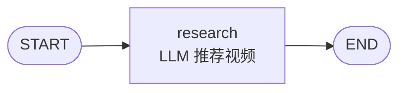

# research_subgraph

## 功能

输入一个主题关键词，用 LLM 推荐 3-5 个相关的 B 站 / YouTube 视频，返回候选 URL 列表。

## 输入 State

| 字段 | 类型 | 必填 | 说明 |
|------|------|------|------|
| `topic` | `str` | ✅ | 研究主题关键词 |

## 输出 State

| 字段 | 类型 | 说明 |
|------|------|------|
| `raw_llm_output` | `Optional[str]` | LLM 原始返回（调试用） |
| `selected_videos` | `List[Dict]` | 视频元数据列表（title/url/platform/note） |
| `video_urls` | `List[str]` | 清洗后的合法 URL 列表 |
| `error` | `Optional[str]` | 失败原因，None 表示成功 |

## 结构图



## 配置（ResearchConfig）

| 字段 | 类型 | 默认值 | 说明 |
|------|------|------|------|
| `timeout` | `int` | 120 | LLM 调用超时秒 |
| `output_dir` | `Optional[Path]` | None | 研究结果保存目录，None 不保存 |
| `min_videos` | `int` | 3 | 希望 LLM 推荐的最少数 |
| `max_videos` | `int` | 5 | 希望 LLM 推荐的最多数 |

## 被谁使用

- `01-video-md/main_graph.py`
- 未来：任何需要"主题 → 视频候选"的 Pipeline

## 依赖

- 环境变量：`MINIMAX_CN_API_KEY`
- LLM：MiniMax-M2

## 独立测试

```bash
cd ai-pipeline/
python -m subgraphs.research_subgraph.test "AI Agent 发展趋势"
```
