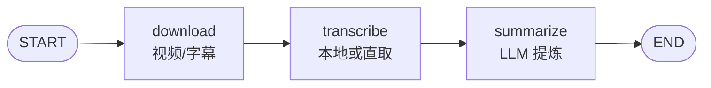

# transcribe_subgraph

## 功能

输入单个视频 URL，顺序执行：**下载 → 转录 → 总结**，输出结构化摘要。

三步拆成独立 node 的理由：
- 每步独立超时
- 每步独立重试
- State 清晰展示中间产物
- 换实现不影响其他步骤

## 输入 State

| 字段 | 类型 | 必填 | 说明 |
|------|------|------|------|
| `video_url` | `str` | ✅ | B 站或 YouTube 视频链接 |
| `task_idx` | `int` | ✅ | 任务索引，用于输出目录隔离 |
| `topic` | `str` | ❌ | 主题（可选，上下文用） |

## 输出 State

| 字段 | 类型 | 说明 |
|------|------|------|
| `summary` | `Optional[str]` | 最终总结文本 |
| `success` | `bool` | 三步全通过则 True |
| `error` | `Optional[str]` | 失败时的 reason |
| `title` | `Optional[str]` | 视频标题 |
| `duration` | `Optional[int]` | 时长（秒） |
| `srt_path` | `Optional[str]` | SRT 文件路径 |
| `file_path` | `Optional[str]` | 下载文件路径 |

## 结构图



## 配置（TranscribeConfig）

| 字段 | 类型 | 默认值 | 说明 |
|------|------|------|------|
| `timeout_download` | `int` | 300 | 下载超时秒 |
| `timeout_transcribe` | `int` | 300 | 转录超时秒 |
| `timeout_summarize` | `int` | 120 | 总结超时秒 |
| `output_base` | `Optional[Path]` | None | 输出根目录 |
| `tools_src` | `Optional[Path]` | None | 工具源码目录 |

## 错误处理

- 任一步失败：写 `error` 字段 + `success=False`，后续步骤检测到 error 会短路跳过
- 直取字幕优先：`subtitle_path` 存在时跳过本地转录

## 并发写入隔离

输出路径为 `output_base/task-{idx}/`，**不同 task_idx 互不干扰**。
主 Graph fan-out 时确保 task_idx 唯一即可。

## 被谁使用

- `01-video-md/main_graph.py`
- 未来：任何需要"视频 → 摘要"的 Pipeline（如 02-podcast-md）

## 依赖

- 环境变量：`MINIMAX_CN_API_KEY`
- 工具模块：`video_download`、`audio_transcribe`、`whisper_summarizer`
  - 通过 config.tools_src 注入路径

## 独立测试

```bash
cd ai-pipeline/
python -m subgraphs.transcribe_subgraph.test "https://www.bilibili.com/video/BV..."
```
