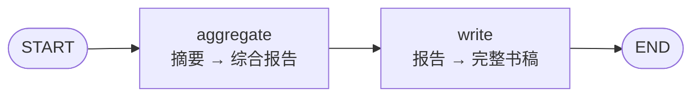

# write_book_subgraph

## 功能

输入多个视频的摘要，两步生成结构完整的电子书：

1. **aggregate**：多摘要 → 综合报告（按主题归类 + 核心观点 + 行动建议）
2. **write**：综合报告 → 完整书稿（≥ 5 章，≥ 2000 字）

## 输入 State

| 字段 | 类型 | 必填 | 说明 |
|------|------|------|------|
| `topic` | `str` | ✅ | 书稿主题 |
| `summaries` | `List[Dict]` | ✅ | 每条含 `video` / `title` / `summary` |

## 输出 State

| 字段 | 类型 | 说明 |
|------|------|------|
| `integrated_report` | `Optional[str]` | 综合报告（中间产物） |
| `book` | `Optional[str]` | 最终书稿正文（不含 H1） |
| `error` | `Optional[str]` | 失败时的 reason |

## 结构图



## 配置（WriteBookConfig）

| 字段 | 默认 | 说明 |
|------|------|------|
| `timeout_aggregate` | 180 | aggregate 超时秒 |
| `timeout_write` | 300 | write 超时秒 |
| `min_chapters` | 5 | 期望最少章节数 |
| `min_words` | 2000 | 期望最少字数 |

## 错误降级

- aggregate 失败：用原始摘要拼接代替综合报告
- write 失败：用综合报告作为 book 返回
- 摘要为空：生成占位内容

保证总有可用输出，不会空返回。

## 被谁使用

- `01-video-md/main_graph.py`
- 未来：任何"多来源摘要 → 长文书稿"场景（播客、文章汇总等）

## 依赖

- 环境变量：`MINIMAX_CN_API_KEY`
- LLM：MiniMax-M2

## 独立测试

```bash
cd ai-pipeline/
python -m subgraphs.write_book_subgraph.test
```

（使用内置 mock 摘要测试）
